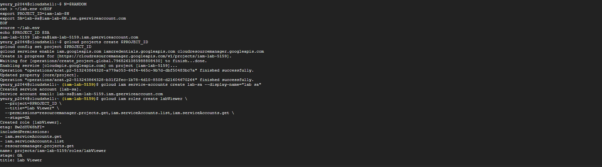
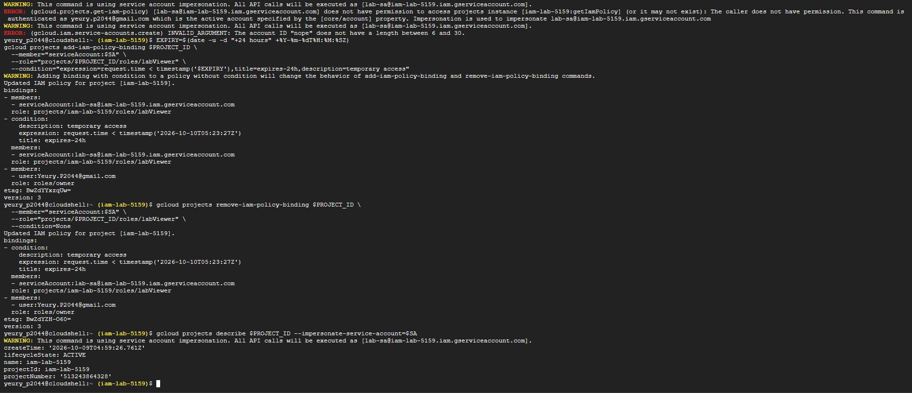
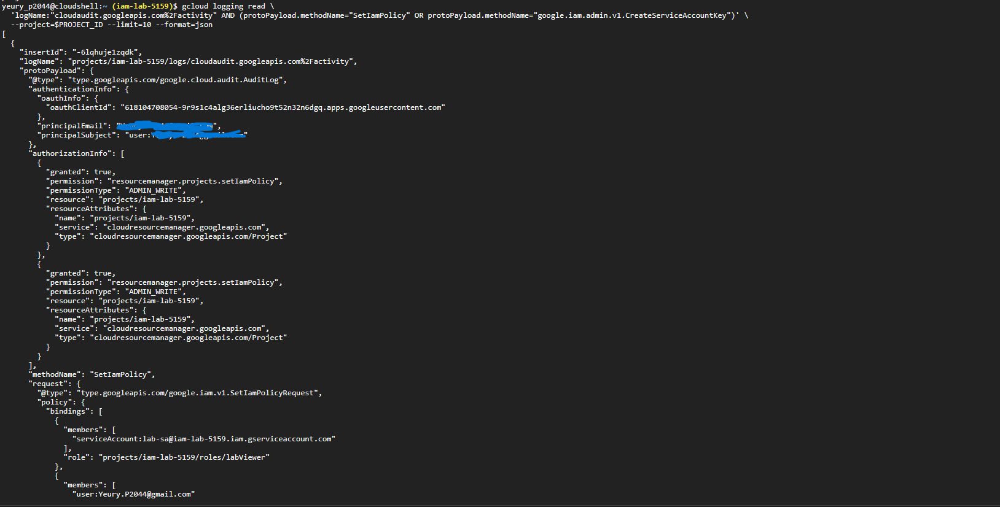
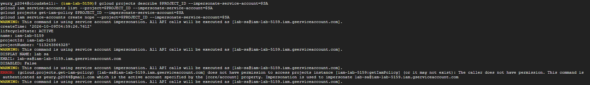
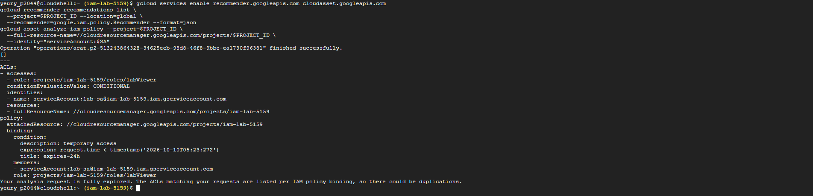

# gcp-iam-lab-README.md
Cloud security and IR labs: GCP IAM, threat modeling, detection. Commands, screenshots, findings.

# GCP IAM Lab: Least Privilege, Expiring Access, Audit Trail

Hands-on lab in a fresh GCP project, run from Cloud Shell. I had done the AWS
equivalent; this maps it to GCP and shows the detection side too.

## What I built
- Service account with a custom role of three permissions
- Impersonation instead of keys (Token Creator binding)
- Denied-access test proving the role boundary
- IAM condition: access that expires after 24 hours
- Created and deleted a service account key to show the risk
- Found the matching Admin Activity entries in Cloud Audit Logs

## Evidence






## Key commands
```bash
gcloud iam service-accounts create lab-sa
gcloud iam roles create labViewer --project=$PROJECT_ID \
  --permissions=resourcemanager.projects.get,iam.serviceAccounts.list,iam.serviceAccounts.get --stage=GA
gcloud projects add-iam-policy-binding $PROJECT_ID \
  --member="serviceAccount:$SA" --role="projects/$PROJECT_ID/roles/labViewer" \
  --condition="expression=request.time < timestamp('$EXPIRY'),title=expires-24h"
```

## AWS to GCP mapping
| AWS | GCP |
|---|---|
| IAM role | Service account plus role binding |
| CloudTrail | Cloud Audit Logs |
| GuardDuty | Security Command Center |
| SCPs | Organization policies |
| Access Analyzer | Policy Analyzer / IAM Recommender |

## Findings
- A service account is both an identity and a resource; AWS roles are only assumed.
- Keys never expire by default and leak through repos and tickets.
  Fix: attached service accounts and Workload Identity Federation.
- Conditions give just-in-time access with no cleanup job.

## Not completed
Log-based alert on `SetIamPolicy`. The metrics API required billing on the
project, so I designed it but did not deploy it. Filter I would use:
`logName:"cloudaudit.googleapis.com%2Factivity" AND protoPayload.methodName="SetIamPolicy"`

## What I would do in production
- Workload Identity Federation for external workloads, no long-lived keys
- Alert on every `SetIamPolicy`, then tune out expected change windows
- Org policy `iam.disableServiceAccountKeyCreation`
- Review IAM Recommender output after 90 days of usage data
